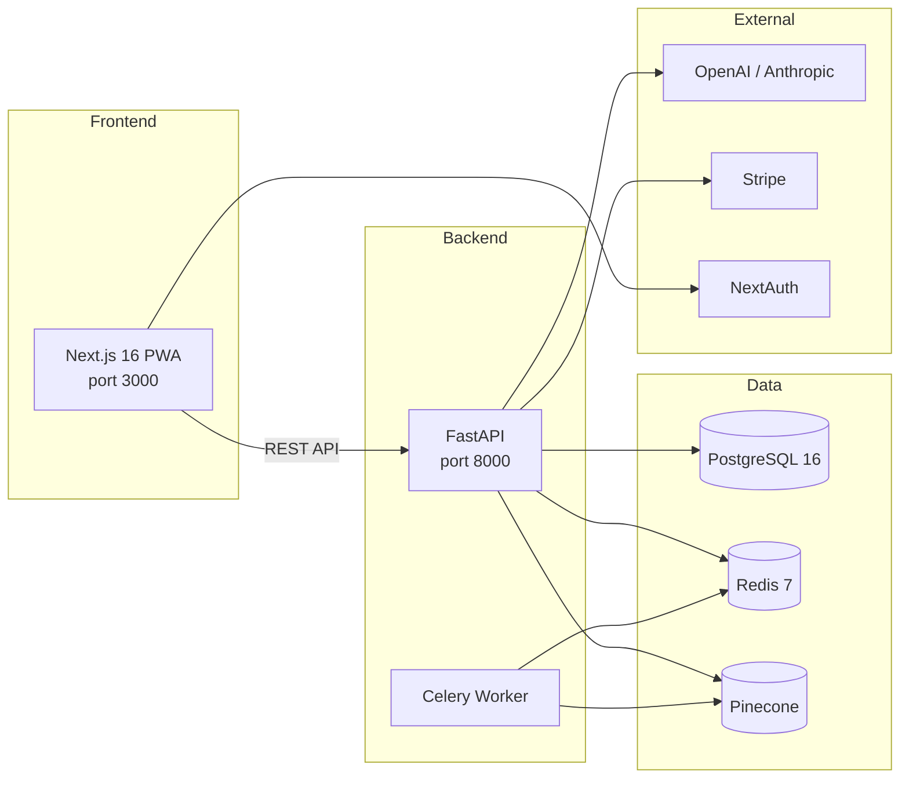

# Arbiter AI

**The AI-powered rules judge for tabletop gaming.** Upload your game's rulebook, ask questions in natural language, and get cited verdicts backed by RAG (Retrieval-Augmented Generation).

## Architecture



| Layer         | Tech                                | Purpose                              |
| ------------- | ----------------------------------- | ------------------------------------ |
| Frontend      | Next.js 16, React 19, TypeScript    | PWA with App Router                  |
| Backend       | FastAPI, Python 3.12+, SQLAlchemy 2 | REST API + async workers             |
| Auth          | NextAuth.js (JWT strategy)          | Session management + JWT validation  |
| Billing       | Stripe Checkout + Webhooks          | PRO tier subscriptions               |
| Vector DB     | Pinecone Serverless                 | Namespace-per-ruleset embeddings     |
| Relational DB | PostgreSQL 16                       | Users, sessions, rulesets, audit log |
| Queue         | Redis 7 + Celery                    | Async PDF ingestion pipeline         |
| LLM           | OpenAI (default), Anthropic (alt)   | RAG adjudication engine              |

## Prerequisites

- **Node.js** 20+ and npm
- **Python** 3.12+ and [uv](https://docs.astral.sh/uv/)
- **Docker** and Docker Compose
- API keys for OpenAI and Pinecone (minimum viable)

## Quick Start

```bash
# 1. Clone and configure
git clone <repo-url> && cd arbiter-ai
cp .env.example .env
# Edit .env with your API keys (see Environment Variables below)

# 2. Start infrastructure (Postgres + Redis)
make up

# 3. Install dependencies
cd backend && uv sync && cd ..
cd frontend && npm install && cd ..

# 4. Run database migrations
make migrate

# 5. Start dev servers (in separate terminals)
make backend    # → http://localhost:8000
make frontend   # → http://localhost:3000
```

Or use Docker Compose for everything:

```bash
docker compose up --build
```

## Make Targets

| Command         | Description                          |
| --------------- | ------------------------------------ |
| `make up`       | Start Postgres + Redis containers    |
| `make down`     | Stop Docker services                 |
| `make migrate`  | Run Alembic DB migrations            |
| `make backend`  | Start FastAPI dev server (port 8000) |
| `make frontend` | Start Next.js dev server (port 3000) |
| `make test`     | Run backend pytest suite             |
| `make lint`     | Run ruff + mypy                      |
| `make dev`      | Start Docker + print instructions    |

## Environment Variables

Copy `.env.example` to `.env` and fill in your values. Key groups:

| Variable                | Required    | Description                                     |
| ----------------------- | ----------- | ----------------------------------------------- |
| `OPENAI_API_KEY`        | ✅          | LLM for RAG adjudication                        |
| `PINECONE_API_KEY`      | ✅          | Vector store for embeddings                     |
| `DATABASE_URL`          | ✅          | PostgreSQL connection string                    |
| `NEXTAUTH_SECRET`       | ✅          | Must match frontend NextAuth config             |
| `STRIPE_SECRET_KEY`     | For billing | Stripe API key                                  |
| `STRIPE_WEBHOOK_SECRET` | For billing | Stripe webhook signature                        |
| `STRIPE_PRICE_ID`       | For billing | PRO tier price ID                               |
| `REDIS_URL`             | ✅          | Redis for Celery + caching                      |
| `ALLOWED_ORIGINS`       | ✅          | CORS origins (default: `http://localhost:3000`) |

See [.env.example](.env.example) for the complete list with defaults.

## API Documentation

With the backend running, visit:

- **Swagger UI**: http://localhost:8000/docs
- **ReDoc**: http://localhost:8000/redoc

The API has 43 endpoints across 12 route modules. See [spec.md](spec.md) for the full routes table.

## Testing

```bash
# Backend (31 tests)
make test

# Linting
make lint
```

## Project Structure

```
├── backend/
│   ├── app/
│   │   ├── main.py           # FastAPI app factory
│   │   ├── config.py         # Pydantic Settings (all env vars)
│   │   ├── api/
│   │   │   ├── deps.py       # Auth (NextAuth JWT), DB, Redis injection
│   │   │   ├── middleware.py  # RequestID, logging, error handling
│   │   │   └── routes/       # 12 route modules (43 endpoints)
│   │   ├── models/
│   │   │   ├── tables.py     # SQLAlchemy ORM (10 tables)
│   │   │   ├── schemas.py    # Pydantic request/response schemas
│   │   │   └── database.py   # Async engine + session factory
│   │   └── core/             # Ingestion, retrieval, judge engine
│   ├── alembic/              # DB migrations
│   └── tests/                # pytest suite (31 tests)
├── frontend/
│   └── src/
│       ├── app/              # Next.js App Router (14 routes)
│       ├── lib/api.ts        # Typed API client (30 methods)
│       └── components/       # Shadcn UI components
├── docs/
│   └── aws-deployment.md     # AWS deployment guide
├── docker-compose.yml        # Full-stack Docker setup
├── Makefile                  # Dev command shortcuts
├── .env.example              # Environment variable template
├── prd.md                    # Product requirements
├── spec.md                   # Technical specification
└── plan.md                   # Implementation checklist
```

## Deployment

See [docs/aws-deployment.md](docs/aws-deployment.md) for the AWS deployment guide covering ECS Fargate, RDS, ElastiCache, and CI/CD.

## License

Proprietary — All rights reserved.
