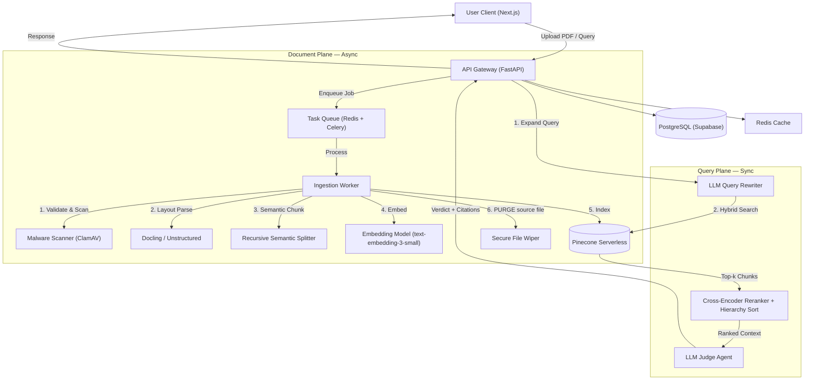
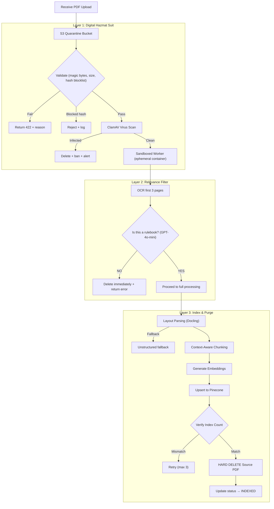
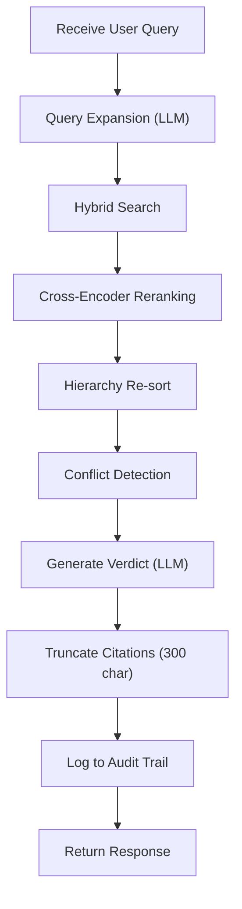
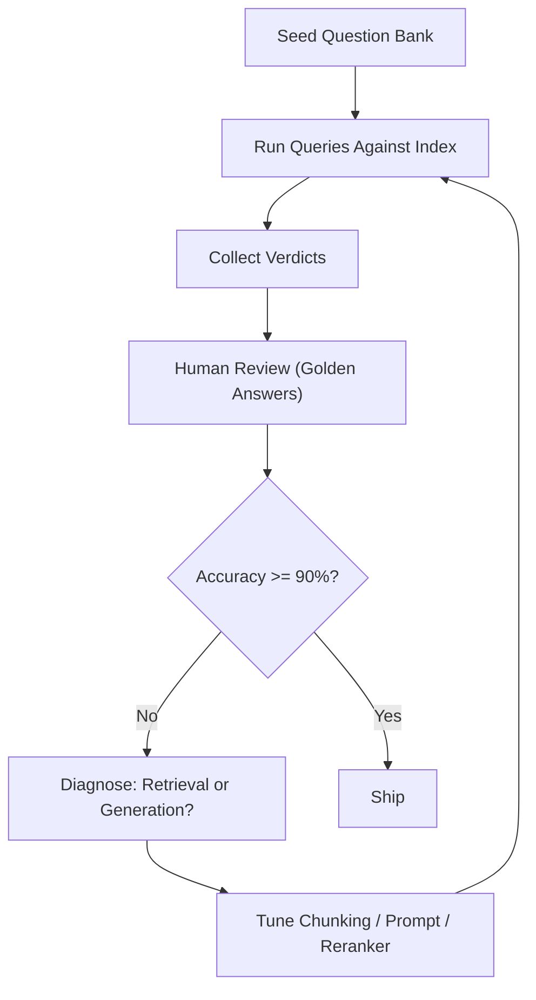
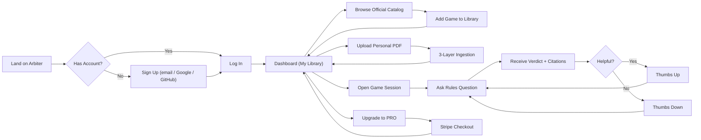

# Project ARBITER — Technical Product Requirements Document

**Version:** 2.0 (MVP)
**Classification:** STRICT_COMPLIANCE (Legal Constraints Apply)
**Platform:** Progressive Web App (PWA) — installable on desktop & mobile
**Core Stack:** Python 3.12+ (Backend), Next.js 14+ (Frontend/PWA), Pinecone Serverless (Vector DB), Redis (Queue), PostgreSQL (Relational), Stripe (Billing), OpenAI / Anthropic (LLM)

---

## 1. System Overview

**Arbiter AI** is a RAG-based adjudication engine for board game rules.

**Core Loop:** User uploads a rulebook (PDF) → System ingests, parses layout, and vectorizes → User asks natural-language questions → System retrieves relevant chunks, applies hierarchy-aware reranking, and synthesizes a verdict with strict citations → Original PDF is purged (Free Tier).

### 1.1 Design Principles

| #   | Principle                  | Rationale                                                                                                                        |
| --- | -------------------------- | -------------------------------------------------------------------------------------------------------------------------------- |
| 1   | **Zero-Retention Default** | We store _vectors_ and _metadata_ only. Original PDFs are purged after indexing (Free Tier) to respect copyright.                |
| 2   | **Citation is King**       | Every answer must map to specific retrieved chunks with page numbers. No citation = "Insufficient context" response.             |
| 3   | **Hierarchy Aware**        | Errata overrides Expansion, Expansion overrides Base game rules. Encoded via `source_priority`.                                  |
| 4   | **Tenant Isolation**       | Each user's data lives in its own Pinecone namespace. Queries _never_ cross namespace boundaries.                                |
| 5   | **Graceful Degradation**   | On low confidence or conflicting rules, the system must surface the conflict transparently rather than hallucinate a resolution. |

### 1.2 Target Users

- **Primary:** Tabletop gamers mid-session who need quick, authoritative rule clarifications.
- **Secondary:** Board game café staff, tournament organizers, and rules-reference creators.
- **Tertiary:** Board game publishers who want to offer AI-powered rule lookup for their titles.

---

## 2. Architecture & Data Flow

### 2.1 High-Level Diagram



### 2.2 Component Responsibilities

| Component        | Technology                                 | Purpose                                                              |
| ---------------- | ------------------------------------------ | -------------------------------------------------------------------- |
| API Gateway      | FastAPI + Uvicorn                          | REST endpoints, auth, rate limiting, request validation              |
| Task Queue       | Redis + Celery                             | Async PDF ingestion jobs with retry and DLQ                          |
| Ingestion Worker | Python (Celery task)                       | PDF parsing, chunking, embedding, indexing, cleanup                  |
| Layout Parser    | Docling (primary), Unstructured (fallback) | Multi-column PDF parsing, table detection, reading order             |
| Embedding        | OpenAI `text-embedding-3-small` (1536d)    | Chunk vectorization                                                  |
| Vector Store     | Pinecone Serverless                        | Semantic search, namespace-per-tenant isolation                      |
| Reranker         | Cohere Rerank v3 or `bge-reranker-v2-m3`   | Cross-encoder reranking of candidate chunks                          |
| LLM Judge        | OpenAI GPT-4o / Anthropic Claude 3.5       | Query expansion, verdict generation with citations                   |
| Relational DB    | PostgreSQL (Supabase)                      | Users, sessions, ruleset metadata, audit logs                        |
| Cache            | Redis                                      | Session cache, rate-limit counters, query result cache               |
| Frontend         | Next.js 14 (App Router)                    | PWA shell, chat UI, citation viewer, file upload, session management |
| Billing          | Stripe Checkout + Customer Portal          | Subscription management, FREE→PRO upgrades, invoicing                |
| Auth             | Supabase Auth (or Auth0)                   | Email/password + OAuth (Google, GitHub), JWT issuance                |

### 2.3 Data Schema

#### A. Relational (PostgreSQL / Supabase)

> [!IMPORTANT]
> All user-generated data is scoped per-user via `user_id` foreign keys. Publisher-owned data (official rulesets) is shared read-only and scoped by `publisher_id`. Users access official rulesets via their personal library.

```sql
-- Core tables
users (
  id            UUID PRIMARY KEY DEFAULT gen_random_uuid(),
  email         TEXT UNIQUE NOT NULL,
  tier          TEXT NOT NULL DEFAULT 'FREE' CHECK (tier IN ('FREE', 'PRO')),
  stripe_customer_id TEXT,       -- Created on first Stripe interaction
  stripe_subscription_id TEXT,   -- Active subscription ID (NULL for FREE)
  tier_updated_at TIMESTAMPTZ,
  created_at    TIMESTAMPTZ DEFAULT now(),
  updated_at    TIMESTAMPTZ DEFAULT now()
);

sessions (
  id            UUID PRIMARY KEY DEFAULT gen_random_uuid(),
  user_id       UUID REFERENCES users(id) ON DELETE CASCADE,
  game_name     TEXT NOT NULL,
  active_ruleset_ids UUID[],
  created_at    TIMESTAMPTZ DEFAULT now(),
  expires_at    TIMESTAMPTZ NOT NULL  -- 24h for FREE, 30d for PRO
);

ruleset_metadata (
  id            UUID PRIMARY KEY DEFAULT gen_random_uuid(),
  session_id    UUID REFERENCES sessions(id) ON DELETE CASCADE,
  user_id       UUID REFERENCES users(id) ON DELETE CASCADE,
  filename      TEXT NOT NULL,
  game_name     TEXT NOT NULL,
  source_type   TEXT NOT NULL CHECK (source_type IN ('BASE', 'EXPANSION', 'ERRATA')),
  source_priority INT NOT NULL DEFAULT 0,  -- 0=Base, 10=Expansion, 100=Errata
  chunk_count   INT DEFAULT 0,
  status        TEXT NOT NULL DEFAULT 'PROCESSING'
                CHECK (status IN ('PROCESSING', 'INDEXED', 'FAILED', 'EXPIRED')),
  error_message TEXT,
  created_at    TIMESTAMPTZ DEFAULT now()
);

-- Publisher-managed official rulesets (shared, read-only for users)
publishers (
  id            UUID PRIMARY KEY DEFAULT gen_random_uuid(),
  name          TEXT NOT NULL,               -- e.g. "Leder Games"
  slug          TEXT UNIQUE NOT NULL,         -- e.g. "leder-games"
  api_key_hash  TEXT NOT NULL,                -- hashed API key for publisher uploads
  contact_email TEXT NOT NULL,
  verified      BOOLEAN DEFAULT false,
  created_at    TIMESTAMPTZ DEFAULT now()
);

official_rulesets (
  id            UUID PRIMARY KEY DEFAULT gen_random_uuid(),
  publisher_id  UUID REFERENCES publishers(id) ON DELETE CASCADE,
  game_name     TEXT NOT NULL,
  source_type   TEXT NOT NULL CHECK (source_type IN ('BASE', 'EXPANSION', 'ERRATA')),
  source_priority INT NOT NULL DEFAULT 0,
  version       TEXT NOT NULL DEFAULT '1.0',  -- Publisher can push updates
  chunk_count   INT DEFAULT 0,
  status        TEXT NOT NULL DEFAULT 'PROCESSING'
                CHECK (status IN ('PROCESSING', 'INDEXED', 'FAILED')),
  pinecone_namespace TEXT NOT NULL,           -- 'official_{publisher_slug}_{game_slug}'
  created_at    TIMESTAMPTZ DEFAULT now(),
  updated_at    TIMESTAMPTZ DEFAULT now()
);

-- User's personal game library (bookmarks official + personal rulesets)
user_game_library (
  id            UUID PRIMARY KEY DEFAULT gen_random_uuid(),
  user_id       UUID REFERENCES users(id) ON DELETE CASCADE,
  game_name     TEXT NOT NULL,
  official_ruleset_ids UUID[],               -- References to official_rulesets
  personal_ruleset_ids UUID[],               -- References to user-uploaded ruleset_metadata
  is_favorite   BOOLEAN DEFAULT false,
  last_queried  TIMESTAMPTZ,
  created_at    TIMESTAMPTZ DEFAULT now()
);

-- File hash blocklist for known-bad uploads
file_blocklist (
  hash          TEXT PRIMARY KEY,            -- SHA-256 hash
  reason        TEXT NOT NULL,
  reported_by   UUID REFERENCES users(id),
  created_at    TIMESTAMPTZ DEFAULT now()
);

query_audit_log (
  id            UUID PRIMARY KEY DEFAULT gen_random_uuid(),
  session_id    UUID REFERENCES sessions(id) ON DELETE SET NULL,
  user_id       UUID REFERENCES users(id) ON DELETE SET NULL,
  query_text    TEXT NOT NULL,
  expanded_query TEXT,
  verdict_summary TEXT,
  confidence    FLOAT,
  citation_ids  TEXT[],
  latency_ms    INT,
  feedback      TEXT CHECK (feedback IN ('up', 'down', NULL)),
  created_at    TIMESTAMPTZ DEFAULT now()
);
```

#### B. Vector Store (Pinecone Serverless)

| Setting        | Value                           |
| -------------- | ------------------------------- |
| **Index Name** | `arbiter-rules`                 |
| **Dimensions** | 1536 (`text-embedding-3-small`) |
| **Metric**     | Cosine                          |

**Namespace Strategy (Dual):**

| Namespace Pattern                       | Owner           | Persistence                                   | Use Case                                  |
| --------------------------------------- | --------------- | --------------------------------------------- | ----------------------------------------- |
| `user_{user_id}`                        | Individual user | Expires with session (FREE) or persists (PRO) | User-uploaded personal rulesets           |
| `official_{publisher_slug}_{game_slug}` | Publisher       | Permanent (publisher-managed)                 | Official rulesets shared across all users |

> [!NOTE]
> When a user queries a game in their library, the system searches **both** the official namespace (if the game has one) and the user's personal namespace, then merges results via RRF before reranking.

**Vector Metadata Schema:**

```json
{
  "text": "string — the chunk text (max 1000 chars)",
  "page_number": "int",
  "section_header": "string — hierarchical path, e.g. 'Combat > Dice Roll > Modifiers'",
  "source_type": "enum: BASE | EXPANSION | ERRATA",
  "source_priority": "int: 0=Base, 10=Expansion, 100=Errata",
  "is_official": "boolean — true if from publisher-managed ruleset",
  "ruleset_id": "string (UUID) — links back to ruleset_metadata or official_rulesets",
  "session_id": "string (UUID, nullable for official)",
  "game_name": "string"
}
```

---

## 3. Functional Specifications

### 3.1 Feature: Ingestion Pipeline ("The Shredder")

**Trigger:** `POST /api/v1/rules/upload`
**Constraint:** Must handle multi-column PDFs, tables, and sidebar callouts.

#### Processing Flow — 3-Layer Defense-in-Depth



#### Layer 1: Security & Malware Prevention ("Digital Hazmat Suit")

1. **Quarantine:** Uploaded file goes to an isolated S3 bucket (or local quarantine dir). No processing until cleared.

2. **Validation**
   - File type: PDF only (check magic bytes `%PDF-`, not just extension)
   - File size: ≤ 50 MB, page count: ≤ 500 pages
   - **Hash Blocklist:** SHA-256 hash checked against `file_blocklist` table. Known-bad files rejected instantly.
   - Duplicate detection: hash check against existing `ruleset_metadata` for the session

3. **Virus Scan**
   - ClamAV (Docker container) scans the quarantined file
   - If malware detected → delete file, log incident, optionally flag user account

4. **Sandboxed Processing**
   - All PDF processing runs in an **ephemeral, isolated container** (Docker with no network access to DB)
   - If a zero-day PDF exploit triggers, it fires inside a throwaway container with no access to user data or production infrastructure
   - Container is destroyed after each job

#### Layer 2: Content Relevance Filter ("The Shibboleth")

This is the strongest defense against illegal/inappropriate content. If it's not a game rulebook, it's killed.

5. **OCR Quick Extract:** Parse the first 3 pages of the document

6. **Rulebook Classification (LLM)**
   - Use a cheap, fast model (GPT-4o-mini) with the prompt:
     > _"Does this text appear to be a board game or tabletop game rulebook? Look for terms like 'Setup', 'Turn Order', 'Victory Points', 'Components', 'Players', 'Dice', 'Cards'. Answer YES or NO with a one-sentence reason."_
   - **If NO:** Immediate deletion. Return error: `"Upload rejected. This does not appear to be a valid game rulebook."`
   - **If YES:** Proceed to full indexing
   - **Defensibility:** This proves "Standard of Care" — Arbiter is not a passive file host. It actively polices content for its intended purpose only.

#### Layer 3: Indexing & Cleanup

7. **Layout Parsing**
   - **Primary:** [Docling](https://github.com/DS4SD/docling) — deep PDF layout analysis with column detection, table extraction, reading-order reconstruction
   - **Fallback:** [Unstructured](https://github.com/Unstructured-IO/unstructured) — if Docling fails or times out
   - **Critical:** Do **NOT** use simple `pypdf` / `PyPDF2` linear text extraction. These merge columns and destroy rule logic.
   - Extract section headers as hierarchical paths (e.g., `"Setup > Player Count > Two-Player Variant"`)

8. **Context-Aware Chunking**
   - **Algorithm:** Recursive Semantic Splitting
     - Split on structural headers first (H1 → H2 → H3)
     - Within sections: split on paragraph boundaries
     - Merge chunks < 200 tokens with their neighbor
     - Split chunks > 800 tokens recursively at sentence boundaries
     - Target chunk size: 300–500 tokens with 50-token overlap
   - **Header Prepending:** Prepend the full section header path to every chunk before embedding
     - Example: `"Combat Phase > Dice Roll: Players roll 2d6 and add their attack modifier..."`
   - **Table Handling:** Convert tables to Markdown format and chunk as atomic units (never split a table row)

9. **Embedding**
   - Model: OpenAI `text-embedding-3-small` (1536 dimensions)
   - Batch size: 100 chunks per API call
   - Include retry with exponential backoff

10. **Indexing**
    - Upsert to Pinecone namespace `user_{user_id}`
    - Vector ID format: `{ruleset_id}_{chunk_index}`
    - After upsert, verify `namespace.describe_index_stats()` count matches expected chunk count

11. **Cleanup (Legal Guardrail)**
    - **HARD DELETE** the temp PDF from disk/object storage (overwrite + unlink)
    - Remove any intermediate parsed text files
    - Update `ruleset_metadata.status` → `INDEXED`
    - If any step fails after 3 retries → status = `FAILED`, store `error_message`, still delete source PDF

### 3.2 Feature: Adjudication Engine ("The Judge")

**Trigger:** `POST /api/v1/judge`

#### Processing Flow



#### Detailed Steps

1. **Query Expansion**
   - LLM rewrites the user's natural-language question for retrieval precision
   - Example: `"Can I attack?"` → `"What are the requirements and conditions to initiate combat or a battle during the Movement Phase or Combat Phase?"`
   - Also extract key game-specific terms for keyword search boost
   - **Decomposition:** For complex queries involving multiple rules (e.g., "Can a Fighter with the Bless spell attack a creature with the Shield spell while flanking?"), decompose into sub-queries and retrieve for each independently

2. **Hybrid Search (Multi-Namespace)**
   - **Dense:** Embed the expanded query → cosine similarity search in Pinecone (top 50)
   - **Sparse:** BM25 keyword search on chunk text for exact game terms (e.g., "Meeple", "Victory Point")
   - **Fusion:** Reciprocal Rank Fusion (RRF) to merge both result sets
   - **Namespace Fan-Out:** Search both `user_{user_id}` and any `official_*` namespaces for games in the user's library, then merge results
   - **Multi-Hop Retrieval:** If the initial result set references other rules by name (e.g., "see Combat Phase rules"), perform a **second retrieval pass** targeting those referenced sections to ensure complete context

3. **Cross-Encoder Reranking**
   - Take top 50 fused results
   - Score each (query, chunk) pair with a cross-encoder model (Cohere Rerank v3 or `bge-reranker-v2-m3`)
   - Select top 10 by cross-encoder score

4. **Hierarchy Re-sort**
   - Among the top 10, if two chunks have high textual overlap (>0.8 Jaccard) but different `source_priority`, promote the higher-priority one
   - Final context window: top 5–8 chunks (dynamically sized to fit within LLM context budget)

5. **Conflict Detection**
   - If chunks from different source types (BASE vs EXPANSION) contain contradictory instructions on the same topic, flag the conflict
   - Include both in context with explicit labeling: `[BASE RULE]` vs `[EXPANSION OVERRIDE]`

6. **Verdict Generation**

   **System Prompt:**

   ```
   You are an impartial board game tournament judge. Your role is to deliver
   accurate, authoritative rulings based EXCLUSIVELY on the provided rule excerpts.

   REASONING PROTOCOL:
   - Think step-by-step. For complex questions, identify ALL relevant rules
     before forming a verdict.
   - If multiple rules interact (e.g., a spell + a status effect + terrain),
     chain them explicitly: "Rule A says X → Rule B modifies X under condition Y → Therefore Z."
   - Consider edge cases: timing conflicts, simultaneous effects, and rule
     precedence (Errata > Expansion > Base).

   STRICT RULES:
   1. Answer ONLY using the provided context chunks. Never use outside knowledge.
   2. If the context is insufficient, respond: "I cannot find a specific rule
      covering this situation in the uploaded rulebook(s). I recommend checking
      [specific section/topic] in your rulebook."
   3. When rules from an EXPANSION or ERRATA override BASE rules, explicitly
      state: "The [Expansion Name] overrides the base rule here."
   4. Always cite the specific page number and section for every claim.
   5. If rules conflict and priority is unclear, present BOTH interpretations
      and note the ambiguity. Never guess.
   6. Keep your verdict concise but complete. Use bullet points for multi-part answers.
   7. For complex interactions, show your reasoning chain before the final verdict.

   CONFIDENCE CALIBRATION:
   - 0.9-1.0: Rule text directly and unambiguously answers the question.
   - 0.7-0.89: Answer requires inference from multiple rules, but is well-supported.
   - 0.5-0.69: Answer involves interpretation; some ambiguity exists.
   - Below 0.5: Insufficient context. Respond with uncertainty disclaimer.
   ```

   **Output Format:**

   ```json
   {
     "verdict": "string — the ruling in natural language",
     "reasoning_chain": "string — step-by-step logic showing how rules were combined (for complex queries)",
     "confidence": 0.0-1.0,
     "confidence_reason": "string — why this confidence level was assigned",
     "citations": [
       {
         "source": "Root_Base.pdf",
         "page": 14,
         "section": "Vagabond > Battle",
         "snippet": "...scores 1 VP per hostile piece removed... (truncated to 300 chars)",
         "is_official": true
       }
     ],
     "conflicts": [
       {
         "description": "Base rule says X, Expansion Y overrides with Z",
         "resolution": "Expansion takes precedence per source_priority"
       }
     ] | null,
     "follow_up_hint": "string | null — suggested follow-up question if the ruling is complex"
   }
   ```

7. **Audit Logging**
   - Log every query, expanded query, verdict summary, confidence, confidence_reason, citation IDs, and latency to `query_audit_log`
   - Enable user feedback (`thumbs_up` / `thumbs_down`) to track answer quality
   - Low-confidence verdicts (< 0.5) automatically flagged for quality review

### 3.3 Feature: Session Management

| Tier | Session Duration | Max Rulesets             | Max File Size | Queries/Min | PDF Retention                           |
| ---- | ---------------- | ------------------------ | ------------- | ----------- | --------------------------------------- |
| FREE | 24 hours         | 2 (1 Base + 1 Expansion) | 25 MB         | 10          | Purged immediately                      |
| PRO  | 30 days          | 10                       | 50 MB         | 60          | Purged after indexing (vectors persist) |

- Sessions auto-expire via a scheduled cleanup job (Celery Beat)
- On expiry: delete Pinecone namespace vectors, mark `ruleset_metadata.status` → `EXPIRED`
- All session data is scoped to the authenticated user — users can only access their own sessions

### 3.4 Feature: User Accounts & Billing (Stripe)

#### Account Lifecycle

1. **Sign Up:** User registers via Supabase Auth (email/password or OAuth — Google, GitHub)
2. **Free Tier:** Default. No payment required. Limited sessions and query rates.
3. **Upgrade to PRO:** User clicks "Upgrade" → Stripe Checkout session created → redirected to Stripe-hosted payment page → webhook confirms subscription → `users.tier` updated to `PRO`
4. **Manage Subscription:** PRO users access Stripe Customer Portal to update payment method, cancel, or view invoices
5. **Downgrade / Cancel:** Stripe webhook fires `customer.subscription.deleted` → `users.tier` reverted to `FREE` → excess sessions/vectors cleaned up on next expiry cycle

#### Stripe Integration Points

| Endpoint                        | Purpose                                                 |
| ------------------------------- | ------------------------------------------------------- |
| `POST /api/v1/billing/checkout` | Creates Stripe Checkout Session, returns redirect URL   |
| `POST /api/v1/billing/portal`   | Creates Stripe Customer Portal session for self-service |
| `POST /api/v1/webhooks/stripe`  | Receives Stripe webhook events (signature-verified)     |

#### Key Stripe Webhook Events

| Event                           | Action                                         |
| ------------------------------- | ---------------------------------------------- |
| `checkout.session.completed`    | Set `tier=PRO`, store `stripe_subscription_id` |
| `customer.subscription.updated` | Sync tier changes                              |
| `customer.subscription.deleted` | Revert to `FREE`, schedule vector cleanup      |
| `invoice.payment_failed`        | Notify user, grace period before downgrade     |

#### Per-User Data Architecture

All user data is strictly isolated:

- **PostgreSQL:** Every row has `user_id` FK; all queries include `WHERE user_id = $1`
- **Pinecone:** Each user gets their own namespace (`user_{user_id}`); queries never cross namespaces
- **Redis:** Rate-limit keys scoped to `rate:{user_id}`
- **File uploads:** Temp files stored in `/{tmp}/arbiter/{user_id}/` and purged after processing

### 3.5 Feature: Official Publisher Rulesets

Publishers can officially upload and maintain authoritative rulesets that all users can access.

#### Publisher Workflow

1. **Onboarding:** Publisher applies → Arbiter team verifies → creates `publishers` record with API key
2. **Upload:** Publisher uses `POST /api/v1/publisher/rulesets/upload` (API-key authenticated) to upload official PDFs
3. **Processing:** Same 3-layer ingestion pipeline, but vectors go to `official_{publisher_slug}_{game_slug}` namespace (persistent, never purged)
4. **Updates:** Publisher uploads a new version → old vectors in the namespace are replaced → `official_rulesets.version` incremented
5. **User Access:** Any user can add an official ruleset to their library → queries automatically search the official namespace

#### Why This Matters

- Users get **always-current** official rules without uploading their own PDFs
- Publishers get a new channel for customer engagement
- Copyright concerns are eliminated for official rulesets (publisher authorizes the use)

### 3.6 Feature: User Game Library

Users can save games and their rulesets for persistent access across sessions.

#### Library Functionality

- **Browse & Add Official:** Users browse a catalog of officially published rulesets and add them to their library with one click
- **Upload Personal:** Users upload their own PDFs (processed through the 3-layer pipeline). PRO users' vectors persist; FREE users' expire after 24h.
- **Combined Search:** When querying a game in their library, the system searches both the official namespace and the user's personal namespace, merging results
- **Favorites:** Users can star/favorite games for quick access
- **History:** Track recently queried games and past verdicts

### 3.7 Feature: Legal Guardrails & Security

#### Defense-in-Depth Summary

If a regulator or lawyer asks _"How do you prevent your platform from being used for illegal content?"_:

1. **"We don't host generic files."** Every upload passes through an algorithmic rulebook-classification check. If it's not a game rulebook, it's deleted within seconds.
2. **"We don't execute code."** All files are virus-scanned and processed in sandboxed, ephemeral containers with no access to production data.
3. **"We don't permanently store source files."** We extract vectors and delete the original file. No raw PDFs survive processing.
4. **"We maintain a blocklist."** Known-bad file hashes are blocked on upload.
5. **"Users warrant legality."** ToS requires users to affirm content is a legitimate game rulebook.

#### Security Controls

| Control                    | Implementation                                                                                     |
| -------------------------- | -------------------------------------------------------------------------------------------------- |
| **3-Layer Ingestion**      | Quarantine → Virus scan → Sandbox → Relevance filter → Index → Purge                               |
| **Snippet Cap**            | Citation `snippet` truncated to 300 chars max in API response                                      |
| **No Full Reconstruction** | Rate-limit sequential queries + monitor for systematic chunk harvesting patterns                   |
| **Anti-Scraping**          | 10 queries/min (FREE), 60 queries/min (PRO), sliding window via Redis                              |
| **Tenant Isolation**       | Pinecone queries scoped to `user_{user_id}` + `official_*` namespaces. No global queries.          |
| **Input Sanitization**     | Reject queries > 500 chars. Strip HTML/script tags. Parameterize all SQL.                          |
| **Hash Blocklist**         | SHA-256 hash of every upload checked against `file_blocklist`. Known-bad files rejected instantly. |
| **Relevance Filter**       | LLM classifies first 3 pages — non-rulebook content deleted immediately.                           |
| **Sandboxed Processing**   | PDF parsing runs in ephemeral containers with no DB/network access.                                |
| **Source Purge**           | PDF hard-deleted (overwrite + unlink) after successful indexing. No temp files survive.            |
| **Auth**                   | JWT-based (Supabase Auth). All endpoints require valid token except health check.                  |
| **HTTPS**                  | TLS required in production. HSTS headers enforced.                                                 |
| **Report Button**          | Required for any future social/sharing features. Content report → review → blocklist.              |

### 3.8 Feature: Rule Quality Assurance

Ensuring correct answers for complex game situations is the core product differentiator. This requires systematic quality controls.

#### The Hard Problem

Board game rules are uniquely challenging for RAG:

- **Cross-referencing:** A single ruling may require rules from 3+ different sections (e.g., movement + terrain + special ability)
- **Conditional chains:** "If X, then Y, unless Z" — nested conditions across pages
- **Timing/priority:** Many games have complex stack/priority systems (e.g., Magic: The Gathering)
- **Errata stacking:** A base rule, modified by an expansion, then corrected by an FAQ
- **Implicit rules:** Some interactions aren't explicitly covered — the answer is "there is no rule for this"

#### Quality Controls

| Control                       | Implementation                                                                                              |
| ----------------------------- | ----------------------------------------------------------------------------------------------------------- |
| **Multi-Hop Retrieval**       | If initial chunks reference other rules, perform a second search pass to retrieve the referenced sections   |
| **Chain-of-Thought**          | System prompt requires explicit reasoning chains for complex multi-rule interactions                        |
| **Confidence Calibration**    | LLM self-scores confidence with explicit criteria (direct answer vs. inference vs. ambiguity)               |
| **Graceful Uncertainty**      | Below 0.5 confidence: system explicitly says "I'm not sure" with a pointer to where to look in the rulebook |
| **Conflict Transparency**     | When rules conflict, both interpretations shown — never silently picks one                                  |
| **Answer Completeness Check** | Prompt instructs LLM to verify all conditions in the question are addressed before returning                |
| **Anti-Hallucination Guard**  | Every factual claim must have a citation. Claims without citations are stripped from the verdict.           |

#### Evaluation Pipeline (Offline)



1. **Seed Question Bank:** Curate 200+ real rules questions across 10+ popular games with verified correct answers
2. **Automated Eval:** Run queries → compare verdicts against golden answers → measure accuracy, citation quality, confidence calibration
3. **Retrieval Diagnostics:** For wrong answers, determine if the failure was:
   - **Retrieval miss:** Correct chunk wasn't in top-K → fix chunking or embedding
   - **Ranking miss:** Correct chunk was retrieved but ranked too low → tune reranker
   - **Generation miss:** Correct chunk was in context but LLM got it wrong → refine prompt
4. **Metrics:**
   - **Answer Accuracy:** % of verdicts that match golden answers (target: ≥ 90%)
   - **Citation Precision:** % of citations that are relevant to the verdict (target: ≥ 95%)
   - **Confidence Calibration:** Correlation between stated confidence and actual accuracy
   - **Uncertainty Recall:** % of truly ambiguous questions correctly flagged as uncertain

#### Feedback Loop (Online)

- **Thumbs Down Analysis:** Weekly review of thumbs-down verdicts to identify patterns (common failure modes, specific games, question types)
- **Automatic Flagging:** Verdicts with confidence < 0.5 or conflicting citations are queued for review
- **Publisher Corrections:** Publishers can flag incorrect verdicts for their games and provide authoritative answers → feeds back into the evaluation set

---

## 4. API Interface

### 4.1 Authentication

| Audience       | Auth Method            | Header                        |
| -------------- | ---------------------- | ----------------------------- |
| **Users**      | JWT (Supabase Auth)    | `Authorization: Bearer <jwt>` |
| **Publishers** | API Key                | `X-Publisher-Key: <api_key>`  |
| **Webhooks**   | Signature Verification | `Stripe-Signature: <sig>`     |

### 4.2 User Endpoints

#### `GET /health`

Returns service status, DB connectivity, Pinecone connectivity.

#### `POST /api/v1/sessions`

Create a new game session.

```json
// Request
{ "game_name": "Root" }
// Response (201)
{ "session_id": "uuid", "game_name": "Root", "expires_at": "2025-02-16T13:00:00Z", "max_rulesets": 2 }
```

#### `POST /api/v1/rules/upload`

Upload a rulebook PDF for processing (3-layer pipeline).

```
Content-Type: multipart/form-data
Fields: file (PDF), session_id (UUID), source_type (BASE|EXPANSION|ERRATA)
```

```json
// Response (202)
{
  "job_id": "uuid",
  "ruleset_id": "uuid",
  "status": "PROCESSING",
  "estimated_seconds": 30
}
```

#### `GET /api/v1/rules/{ruleset_id}/status`

Poll ingestion job status.

```json
// Response (200)
{
  "ruleset_id": "uuid",
  "status": "INDEXED",
  "chunk_count": 142,
  "filename": "Root_Base_Rules.pdf"
}
```

#### `POST /api/v1/judge`

Submit a rules question.

```json
// Request
{ "session_id": "uuid", "query": "Does the Vagabond score VP for destroying items?", "history": [] }
// Response (200)
{
  "verdict": "Yes, but only when the Vagabond removes a hostile piece in battle...",
  "confidence": 0.95,
  "citations": [
    { "source": "Root_Base.pdf", "page": 14, "section": "Vagabond > Battle", "snippet": "...scores 1 VP per hostile piece removed...", "is_official": true }
  ],
  "conflicts": null
}
```

#### `POST /api/v1/judge/{query_id}/feedback`

Submit user feedback on a verdict.

```json
{ "feedback": "up" } // "up" | "down"
```

### 4.3 Library Endpoints

#### `GET /api/v1/library`

Get user's game library.

```json
// Response (200)
{ "games": [{ "id": "uuid", "game_name": "Root", "official_rulesets": [...], "personal_rulesets": [...], "is_favorite": true, "last_queried": "2025-02-14T12:00:00Z" }] }
```

#### `POST /api/v1/library/add`

Add a game (with optional official rulesets) to user's library.

```json
// Request
{ "game_name": "Root", "official_ruleset_ids": ["uuid", "uuid"] }
```

#### `DELETE /api/v1/library/{game_id}`

Remove a game from user's library.

#### `PATCH /api/v1/library/{game_id}/favorite`

Toggle favorite status.

### 4.4 Catalog Endpoints

#### `GET /api/v1/catalog`

Browse all official rulesets available from publishers. Paginated, searchable.

```json
// Response (200)
{
  "games": [
    {
      "game_name": "Root",
      "publisher": "Leder Games",
      "rulesets": [{ "id": "uuid", "source_type": "BASE", "version": "2.1" }]
    }
  ],
  "total": 42,
  "page": 1
}
```

#### `GET /api/v1/catalog/{game_slug}`

Get details for a specific official game.

### 4.5 Publisher Endpoints (API-Key Auth)

#### `POST /api/v1/publisher/rulesets/upload`

Upload/update an official ruleset.

```
Content-Type: multipart/form-data
Fields: file (PDF), game_name, game_slug, source_type (BASE|EXPANSION|ERRATA), version
```

```json
// Response (202)
{
  "ruleset_id": "uuid",
  "status": "PROCESSING",
  "namespace": "official_leder-games_root"
}
```

#### `GET /api/v1/publisher/rulesets`

List all rulesets owned by this publisher.

#### `DELETE /api/v1/publisher/rulesets/{ruleset_id}`

Remove an official ruleset (deletes vectors from namespace).

### 4.6 Billing Endpoints

#### `POST /api/v1/billing/checkout`

Create Stripe Checkout session → returns redirect URL.

#### `POST /api/v1/billing/portal`

Create Stripe Customer Portal session for self-service billing management.

#### `POST /api/v1/webhooks/stripe`

Stripe webhook receiver (signature-verified). Handles subscription lifecycle events.

### 4.7 Error Responses

All errors follow a consistent format:

```json
{
  "error": {
    "code": "RATE_LIMITED",
    "message": "You have exceeded 10 queries per minute.",
    "retry_after_seconds": 12
  }
}
```

Standard error codes: `VALIDATION_ERROR`, `UNAUTHORIZED`, `RATE_LIMITED`, `SESSION_EXPIRED`, `PROCESSING_FAILED`, `NOT_A_RULEBOOK`, `BLOCKED_FILE`, `INTERNAL_ERROR`.

---

## 5. Legal & Copyright Framework

### 5.1 Copyright Position

Board game **rulebook text** is copyright-protected expression. The underlying **game mechanics** are not copyrightable. Arbiter AI operates within fair use by:

1. **Transformative Use:** Synthesizing rules into verdicts (not reproducing the rulebook)
2. **Snippet Limitation:** Never returning more than 300 chars of source text per citation
3. **No Storage of Source:** Original PDFs are deleted after vectorization
4. **Anti-Reconstruction:** Rate limiting + harvesting detection prevents systematic extraction

### 5.2 Terms of Service Requirements

- Users must agree: _"I represent that this file contains board game rules and contains no illegal, explicit, or malicious content."_
- Users accept that source PDFs will be deleted after processing
- DMCA takedown procedure for rights holders to request vector deletion
- Explicit prohibition on using the system to reproduce or redistribute rulebook content
- This limits liability by contract and demonstrates proactive content policing

### 5.3 Publisher Partnership Track (MVP)

- Licensed API access for publishers to host official rule lookup for their titles
- Publisher-managed namespace with persistent vectors (no purge)
- Publishers can push version updates (errata, FAQ, expansion rules)
- Revenue share model or flat monthly fee per title
- Copyright concerns eliminated — publisher explicitly authorizes vectorization

---

## 6. Observability & Telemetry

### 6.1 Success Metrics

| Metric                        | Target                 | Measurement                                                |
| ----------------------------- | ---------------------- | ---------------------------------------------------------- |
| **Query Latency**             | P50 < 1.5s, P95 < 3.0s | Application-level timing in `query_audit_log.latency_ms`   |
| **Answer Accuracy**           | ≥ 90%                  | Offline eval against golden answer set                     |
| **Hallucination Rate**        | < 5%                   | User thumbs-down on citations / total queries              |
| **Confidence Calibration**    | r > 0.8                | Pearson correlation: stated confidence vs. actual accuracy |
| **Uncertainty Recall**        | ≥ 85%                  | % of ambiguous queries correctly flagged as uncertain      |
| **Citation Precision**        | ≥ 95%                  | % of citations relevant to the verdict                     |
| **Ingestion Success**         | > 95%                  | `INDEXED` / (`INDEXED` + `FAILED`) per day                 |
| **Rulebook Reject Accuracy**  | > 98%                  | Non-rulebooks correctly rejected by Layer 2                |
| **Chunk Retrieval Relevance** | MRR@5 > 0.7            | Offline evaluation against labeled query-chunk pairs       |
| **Uptime**                    | 99.5%                  | Health check monitoring                                    |

### 6.2 Logging & Monitoring

- **Structured Logging:** JSON logs via `structlog` (Python) with correlation IDs
- **Metrics:** Prometheus metrics exported via `/metrics` endpoint
  - `arbiter_query_latency_seconds` (histogram)
  - `arbiter_query_confidence` (histogram)
  - `arbiter_ingestion_duration_seconds` (histogram)
  - `arbiter_active_sessions` (gauge)
  - `arbiter_relevance_filter_rejections_total` (counter — Layer 2 rejections)
  - `arbiter_low_confidence_verdicts_total` (counter — confidence < 0.5)
  - `arbiter_thumbs_down_total` (counter — negative feedback)
  - `arbiter_multi_hop_retrieval_total` (counter — queries requiring second retrieval pass)
- **Alerting:** PagerDuty / Slack alerts on:
  - P95 latency > 5s for 5 min
  - Ingestion failure rate > 20% for 15 min
  - Error rate > 5% for 5 min
  - Thumbs-down rate > 15% for 1 hour (rule quality degradation)
- **Tracing:** OpenTelemetry spans across API → Queue → Worker → Pinecone → LLM
- **Quality Dashboard:** Weekly aggregation of accuracy, confidence calibration, and feedback trends

---

## 7. User Journey



---

## 8. Future-Proofing

### 8.1 MCP Integration (v2)

Structure the Adjudication Engine with a pluggable retriever interface:

```python
class IRetriever(Protocol):
    async def retrieve(self, query: str, session_id: str, top_k: int) -> list[Chunk]: ...

# MVP Implementation
class PineconeRetriever(IRetriever): ...

# Future: Publisher-hosted MCP server
class MCPServerRetriever(IRetriever): ...
```

### 8.2 Multi-Modal Support (v2+)

- Image-based rule references (diagrams, board layouts)
- Support for EPUB and HTML rulebook formats
- Voice query input for mid-game hands-free use

### 8.3 Community Features (v3)

- FAQ caching: popular queries cached with community-validated answers
- "House Rules" layer: user-defined overrides with lowest priority
- Game session sharing: multiplayer sessions where all players query the same ruleset
- Content reporting and moderation tools

---

## 9. Repository Structure

```
arbiter-ai/
├── docker-compose.yml          # Local dev: Postgres, Redis, ClamAV
├── .env.example                # Required env vars template
├── Makefile                    # Common dev commands
│
├── backend/
│   ├── pyproject.toml          # Python deps (Poetry / uv)
│   ├── Dockerfile              # Backend container image
│   ├── Dockerfile.worker       # Sandboxed ingestion worker (no DB access)
│   ├── alembic/                # DB migrations
│   ├── app/
│   │   ├── main.py             # FastAPI app factory
│   │   ├── config.py           # Settings via pydantic-settings
│   │   ├── api/
│   │   │   ├── routes/
│   │   │   │   ├── health.py
│   │   │   │   ├── sessions.py
│   │   │   │   ├── rules.py
│   │   │   │   ├── judge.py
│   │   │   │   ├── catalog.py      # Official ruleset browsing
│   │   │   │   ├── publishers.py   # Publisher API (API-key auth)
│   │   │   │   ├── admin.py        # Admin portal (RBAC)
│   │   │   │   ├── rulings.py      # Saved rulings CRUD
│   │   │   │   ├── parties.py      # Party management
│   │   │   │   ├── billing.py      # Stripe checkout + tiers
│   │   │   │   ├── library.py      # User game library CRUD
│   │   │   │   └── users.py        # User profile management
│   │   │   ├── deps.py         # Dependency injection (DB, Auth, Redis)
│   │   │   ├── rate_limit.py   # Redis-backed rate limiter
│   │   │   └── middleware.py   # RequestID, Logging, Error handling
│   │   ├── core/
│   │   │   ├── ingestion.py    # 3-layer ingestion pipeline
│   │   │   ├── adjudication.py # Adjudication engine orchestrator
│   │   │   ├── chunking.py     # Recursive semantic splitter
│   │   │   ├── protocols.py    # Provider Protocol interfaces
│   │   │   └── providers/
│   │   │       ├── registry.py          # Singleton provider factory
│   │   │       ├── openai_llm.py        # OpenAI GPT-4o provider
│   │   │       ├── openai_embeddings.py # OpenAI embeddings
│   │   │       ├── bedrock_llm.py       # AWS Bedrock Claude provider
│   │   │       ├── bedrock_embedding.py # AWS Bedrock Titan v2
│   │   │       ├── pinecone_store.py    # Pinecone vector store
│   │   │       ├── cohere_reranker.py   # Cohere Rerank v3
│   │   │       ├── flashrank_reranker.py # FlashRank local reranker
│   │   │       └── docling_parser.py    # Docling PDF parser
│   │   ├── models/             # SQLAlchemy / Pydantic models
│   │   ├── db/                 # Database session, queries
│   │   └── workers/
│   │       ├── tasks.py        # Celery tasks (ingestion, cleanup, expiry)
│   │       └── quarantine.py   # S3 quarantine bucket management
│   └── tests/
│       ├── unit/
│       ├── integration/
│       └── fixtures/           # Sample PDFs (multi-column, table-heavy, non-rulebook)
│
├── frontend/
│   ├── package.json
│   ├── next.config.js          # PWA + next-pwa config
│   ├── public/
│   │   ├── manifest.json       # PWA manifest
│   │   ├── sw.js               # Service worker (auto-generated by next-pwa)
│   │   ├── icons/              # PWA icons (192x192, 512x512)
│   │   └── offline.html        # Offline fallback page
│   ├── src/
│   │   ├── app/                # Next.js App Router pages
│   │   │   ├── page.tsx        # Landing page
│   │   │   ├── auth/
│   │   │   │   ├── login/page.tsx
│   │   │   │   └── signup/page.tsx
│   │   │   ├── library/
│   │   │   │   └── page.tsx    # User's game library (dashboard)
│   │   │   ├── catalog/
│   │   │   │   └── page.tsx    # Browse official rulesets
│   │   │   ├── session/
│   │   │   │   └── [id]/
│   │   │   │       └── page.tsx  # Chat + adjudication UI
│   │   │   ├── billing/
│   │   │   │   └── page.tsx    # Upgrade / manage subscription
│   │   │   ├── account/
│   │   │   │   └── page.tsx    # User profile & settings
│   │   │   └── layout.tsx      # Root layout with <meta> for PWA
│   │   ├── components/
│   │   │   ├── ChatInterface.tsx
│   │   │   ├── CitationCard.tsx    # Expandable citation viewer
│   │   │   ├── FileUpload.tsx
│   │   │   ├── GameCard.tsx        # Game tile for library/catalog
│   │   │   ├── ConfidenceBadge.tsx
│   │   │   ├── ConflictAlert.tsx
│   │   │   ├── UpgradeBanner.tsx   # FREE tier upgrade CTA
│   │   │   └── InstallPrompt.tsx   # PWA install prompt
│   │   ├── lib/
│   │   │   ├── api.ts          # API client
│   │   │   ├── auth.ts         # Supabase auth helpers
│   │   │   ├── stripe.ts       # Stripe client helpers
│   │   │   └── types.ts        # Shared TypeScript types
│   │   └── styles/
│
└── docs/
    ├── openapi.yaml            # OpenAPI 3.1 spec
    └── architecture.md         # Living architecture doc
```

---

## 10. Implementation Checklist

### Phase 0: Project Setup (Day 1)

- [x] Scaffold monorepo: `backend/` (FastAPI + uv) + `frontend/` (Next.js) + `docker-compose.yml`
- [ ] PWA config: `next-pwa`, `manifest.json`, app icons, root layout `<meta>` tags
- [ ] Stripe setup: product + price for PRO ($9.99/mo), webhook endpoint
- [ ] Auth setup (AWS Cognito or similar)
- [x] `.env.example` with all required variables

### Phase 1: Foundation (Weeks 1–2)

- [x] Docker Compose: Postgres 16, Redis 7, ClamAV
- [x] Alembic migrations: all tables (`users`, `sessions`, `ruleset_metadata`, `publishers`, `official_rulesets`, `user_game_library`, `file_blocklist`, `query_audit_log`)
- [ ] Auth middleware: JWT validation, user context injection
- [ ] User account endpoints: registration, login, profile, per-user data scoping
- [ ] Billing: checkout, portal, webhook handler (subscription lifecycle)
- [x] Config: `pydantic-settings` with `.env` support

### Phase 2: Ingestion Pipeline (Weeks 2–3)

- [x] Provider abstraction layer: 5 Protocol interfaces + singleton registry
- [x] OpenAI LLM/Embeddings, Pinecone, Cohere Reranker, Docling Parser providers
- [x] Pinecone Serverless index (`arbiter-rules`, 1536d, cosine)
- [x] **Layer 1:** Magic-byte validation, size limit, hash blocklist check
- [x] **Layer 2:** GPT-4o-mini rulebook classification (first 3 pages)
- [x] **Layer 3:** Docling parser + PyMuPDF fallback
- [x] **Layer 3:** Recursive semantic chunker with header prepending
- [x] **Layer 3:** Embedding service (`text-embedding-3-small`, batching)
- [x] **Layer 3:** Pinecone upsert + index verification + source file purge
- [ ] Celery worker: full pipeline task with retry/DLQ (currently sync)
- [ ] Test with: dual-column PDF, table-heavy PDF, **non-rulebook PDF (expect rejection)**

### Phase 3: Adjudication Engine (Weeks 3–4)

- [x] LLM-powered query expansion with sub-query decomposition
- [x] Multi-namespace retrieval (fan-out across user + official namespaces)
- [x] Cross-encoder reranker (Cohere Rerank v3)
- [x] Hierarchy re-sort with conflict detection
- [x] Judge system prompt with strict citation enforcement + chain-of-thought
- [x] Audit trail: log queries, verdicts, confidence, latency
- [x] Judge endpoint: `POST /api/v1/judge`
- [x] Feedback endpoint: `POST /api/v1/judge/{query_id}/feedback`

### Phase 4: Frontend (Weeks 4–5)

- [x] PWA shell: manifest, service worker, offline page, install prompt
- [x] Auth pages: login, signup (passwordless magic links via NextAuth)
- [x] Landing page: hero section, value proposition, CTA
- [x] **Game Library (dashboard):** user's saved games, favorites, recent queries
- [x] **Official Catalog:** browse + search publisher-managed rulesets, add to library
- [x] File upload: drag-and-drop PDF, progress indicator, status polling
- [x] Chat interface: message thread with streaming responses
- [x] Citation viewer: expandable cards with page, section, snippet
- [x] Confidence badge (green/yellow/red) + conflict alert
- [x] Billing page: upgrade CTA, Stripe Customer Portal link
- [x] Account page: profile, tier status, usage stats

### Phase 5: Publisher Portal & Hardening (Weeks 5–6)

- [x] Publisher API: upload, list, update, delete official rulesets
- [x] Publisher onboarding flow (admin-side)
- [x] Rate limiting: Redis sliding window (daily query limits per tier)
- [x] Input sanitization, HTTPS enforcement, CORS config
- [x] Prometheus metrics, structured logging, health check
- [x] Consistent error responses, Celery DLQ
- [x] Legal: Terms of Service (user warranty), DMCA procedure, privacy policy

### Phase 6: User Accounts, Billing & Social

- [x] Authentication: Passwordless email login (NextAuth + Brevo magic links)
- [x] Communication layer: Modular email/SMS service (Brevo provider)
- [x] Dev auto-login for local development
- [x] Rate limiting: Redis-backed, per-user daily limits (`rate_limit.py`)
- [x] Admin portal: stats, user/publisher/tier management with RBAC (`admin.py`)
- [x] Saved rulings: pin/save verdicts with privacy controls (`rulings.py`)
- [x] Party management: create/join/leave groups (`parties.py`)
- [x] Billing routes: tier listing, subscription status, Stripe stubs (`billing.py`)
- [x] Configurable billing: database-backed `subscription_tiers` table
- [x] Frontend: Admin, Rulings, Parties dashboard pages
- [x] Alembic migration: `role` column on `users` table

### Phase 7: Agent Builder & Embeddable Widget

- [x] Agent Builder backend: session-based agents with persona + system_prompt
- [x] Agent Builder API: CRUD endpoints for agent management
- [x] Agent Builder frontend: 3-step wizard (Identity → Knowledge → Behavior)
- [x] Embeddable Widget: standalone chat UI with `<script>` tag loader
- [x] Widget API: public endpoint `/widget/{id}` for external embedding

### Phase 8: AWS Migration (Bedrock + FlashRank)

- [x] Dependencies: boto3, flashrank added to pyproject.toml
- [x] Config: AWS env vars and provider selection options
- [x] Provider: Bedrock LLM (Claude 3.5 Sonnet via `bedrock_llm.py`)
- [x] Provider: Bedrock Embeddings (Titan v2 via `bedrock_embedding.py`)
- [x] Provider: FlashRank Reranker (local Python via `flashrank_reranker.py`)
- [x] Registry: all new providers registered and wirable via env var

### Phase 9: Production Hardening & Missing APIs

- [x] JWT Auth: Production NextAuth JWT validation in `deps.py` (was stub)
- [x] Exception chaining: `from exc` / `from None` in deps, billing, webhook handlers
- [x] Stripe checkout: Full Checkout Session creation + 3 webhook lifecycle handlers
- [x] Library API: 5 CRUD endpoints (`library.py`) — list, add, update, favorite, delete
- [x] User profile API: GET/PATCH/DELETE `/users/me` (`users.py`)
- [x] Publisher key rotation: `POST /publishers/{id}/rotate-key`
- [x] Judge namespace resolution: Dynamic namespace from session rulesets
- [x] `JudgeQuery.ruleset_ids`: Optional filter for specific rulesets
- [x] Session expiry enforcement: 410 Gone for expired sessions
- [x] Frontend: Suspense boundary on settings page for SSG compat
- [x] Frontend: `output: standalone` in next.config.ts for Docker deployment
- [x] Frontend: `plan_tier` field alignment across api.ts and settings page

---

## 11. Deployment Strategy

| Environment    | Infrastructure                                                                | Purpose                                  |
| -------------- | ----------------------------------------------------------------------------- | ---------------------------------------- |
| **Local Dev**  | Docker Compose (Postgres, Redis, ClamAV) + `uvicorn --reload` + `npm run dev` | Development                              |
| **Staging**    | Railway / Render / Fly.io                                                     | Pre-production testing, Stripe test mode |
| **Production** | AWS (ECS Fargate) or Fly.io                                                   | Live application                         |

**Production Components:**

- **API Server:** FastAPI on Fargate / Fly.io (auto-scaling)
- **Ingestion Worker:** Sandboxed Celery worker on Fargate (ephemeral tasks, isolated network)
- **Database:** Supabase (managed Postgres) or AWS RDS
- **Vector DB:** Pinecone Serverless (managed, auto-scaling)
- **Cache/Queue:** AWS ElastiCache (Redis) or Upstash Redis
- **Object Storage:** S3 quarantine bucket (ephemeral, auto-delete policy)
- **CDN:** Vercel (Next.js frontend + PWA) or CloudFront
- **Secrets:** AWS Secrets Manager or Doppler

---

## 12. Development Workflow

```bash
# Start local services
docker compose up -d

# Backend
cd backend
uv sync                      # Install Python deps
alembic upgrade head         # Run migrations
celery -A app.workers.tasks worker --loglevel=info  # Start worker
uvicorn app.main:app --reload --port 8000           # Start API

# Frontend
cd frontend
npm install
npm run dev                  # Start Next.js on port 3000
```

### Environment Variables Required

```env
# LLM
OPENAI_API_KEY=sk-...
ANTHROPIC_API_KEY=sk-ant-...

# Pinecone
PINECONE_API_KEY=...
PINECONE_INDEX_NAME=arbiter-rules

# Supabase / Postgres
DATABASE_URL=postgresql://...
SUPABASE_URL=https://...
SUPABASE_ANON_KEY=...

# Redis
REDIS_URL=redis://localhost:6379/0

# Stripe
STRIPE_SECRET_KEY=sk_...
STRIPE_WEBHOOK_SECRET=whsec_...
STRIPE_PRICE_ID=price_...

# Reranker (optional — Cohere)
COHERE_API_KEY=...

# Security
JWT_SECRET=...
ALLOWED_ORIGINS=http://localhost:3000
```
